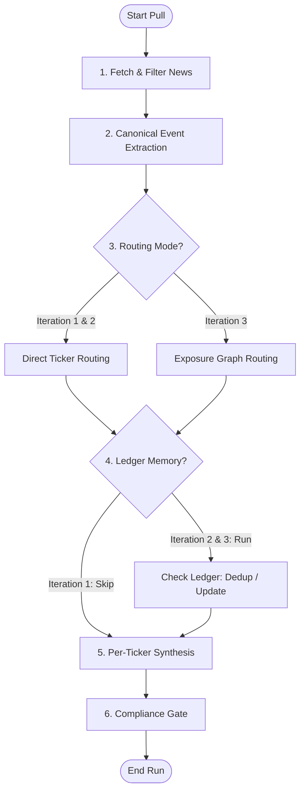

# Implementation Plan - Cross-Impact Catalyst Briefings Demo

This document outlines the design and implementation plan for building the **Intraday Cross-Impact Catalyst Briefings** capstone project demo. The demo will be a web application containing a **React frontend** and a **Python backend (FastAPI)** utilizing **LangGraph** for LLM workflows, **Arize Phoenix** for traceability, and a UI control to toggle between Iterations 1, 2, and 3.

---

## User Review Required

> [!IMPORTANT]
> **API Keys & Demo Scenario Replay:** Real-time news APIs (Finnhub, Currents) have strict rate limits on free tiers, and live financial news might not contain interesting catalysts in a given 5-minute window during testing. To guarantee a high-quality presentation, the system will support both **live API fetching** and a **seeded demo scenario replayer** (e.g., Taiwan Earthquake, Anthropic Model Release, Red Sea Shipping Disruption).
>
> **Default LLM Provider:** We recommend using the **Gemini API** (`gemini-1.5-flash` or `gemini-2.0-flash` / `gemini-2.5-flash`) via the `langchain-google-genai` package for canonical event extraction and synthesis, due to its low latency, high faithfulness, and free/low-cost tier. However, the backend will support standard OpenAI keys if preferred.

---

## Open Questions

1. **LLM Selection:** Are you okay with using Google Gemini as the default LLM, or would you prefer OpenAI?
2. **Arize Phoenix Hosting:** We will run Arize Phoenix as a local collector inside the backend process (listening on `localhost:6006`). The frontend will provide a direct button/link to open this local dashboard. Does this meet your expectations?

---

## Proposed Changes

We will initialize a new workspace structure with a Python backend and a Vite React frontend.

```text
d:\git\problem-first-AI-capstone-team13/
├── backend/
│   ├── requirements.txt
│   ├── .env.example
│   ├── main.py
│   ├── config.py
│   ├── ingestion.py
│   ├── routing.py
│   ├── memory.py
│   ├── graph.py
│   └── seed_data.py
├── frontend/
│   ├── package.json
│   ├── vite.config.ts
│   ├── index.html
│   └── src/
│       ├── main.tsx
│       ├── App.tsx
│       ├── index.css
│       └── components/
│           ├── Watchlist.tsx
│           ├── TickerDetail.tsx
│           ├── GraphViewer.tsx
│           └── TracePanel.tsx
├── implementation_plan.md
└── README.md
```

---

### Backend Component (Python)

The backend runs FastAPI and compiles the LangGraph pipeline. It exposes endpoints to trigger runs, fetch the watchlist, edit the exposure graph, and retrieve past run summaries.

#### [NEW] [requirements.txt](file:///d:/git/problem-first-AI-capstone-team13/backend/requirements.txt)
Defines backend dependencies including:
- `fastapi`, `uvicorn` (server)
- `langgraph`, `langchain-core`, `langchain-google-genai` (LLM workflows)
- `arize-phoenix`, `openinference-instrumentation-langchain` (traceability)
- `sentence-transformers` or `numpy` (local embeddings for catalyst ledger similarity checks)
- `pydantic`, `python-dotenv`, `requests`

#### [NEW] [config.py](file:///d:/git/problem-first-AI-capstone-team13/backend/config.py)
Configures environment variables, system constants, and initializes the **Arize Phoenix** OpenTelemetry tracer.
```python
# Instrument langchain and langgraph automatically
from phoenix.otel import register
from openinference.instrumentation.langchain import LangChainInstrumentor

register(project_name="cross-impact-catalysts")
LangChainInstrumentor().instrument()
```

#### [NEW] [seed_data.py](file:///d:/git/problem-first-AI-capstone-team13/backend/seed_data.py)
Provides seed data for:
1. **The Exposure Graph:** A set of pre-approved nodes and edges for the demo watchlist (e.g. `AAPL`, `MSFT`, `NVDA`, `TSM`, `LMT`, `DAL` linked to `TSMC`, `Taiwan`, `Frontier AI`, `Red Sea`, etc.).
2. **Replay Scenarios:** Pre-populated articles mapping to the 3 iterations to ensure the demo is functional immediately, even without active live API calls.
   - *Scenario A (Direct news - Iteration 1/2/3):* Direct company announcements for AAPL or MSFT.
   - *Scenario B (Duplicate news - Iteration 2/3):* Syndicated versions of a news story released 2 minutes apart to demonstrate deduplication.
   - *Scenario C (Cross-impact news - Iteration 3):* A news story about a Taiwan earthquake or Red Sea shipping disruption containing no direct ticker tags, showing how the graph routes them.

#### [NEW] [ingestion.py](file:///d:/git/problem-first-AI-capstone-team13/backend/ingestion.py)
Implements API fetching clients for:
- Finnhub (`/company-news`, `/stock/peers`)
- Currents (`/search`, `/latest-news`)
- A mock/replay controller that returns scenario articles based on a simulated timestamp.

#### [NEW] [routing.py](file:///d:/git/problem-first-AI-capstone-team13/backend/routing.py)
Implements deterministic path routing and scoring over the exposure graph:
- Matches canonical event tags and entities to graph nodes.
- Traverses the graph from matched nodes up to 3 hops.
- Calculates path scores: `path_score = event_severity * average_edge_confidence * path_shortness_bonus`.
- Drops candidates below the threshold (e.g., `< 0.45`).

#### [NEW] [memory.py](file:///d:/git/problem-first-AI-capstone-team13/backend/memory.py)
Implements the **Catalyst Ledger**:
- Stores fingerprints of active catalysts: `(ticker, event_type, embedding, hard_facts, first_seen_at)`.
- Calculates semantic similarity of new canonical event summaries against active ledger entries (cosine similarity of embeddings).
- Validates hard fact changes to distinguish between **duplicates** (suppressed) and **meaningful updates** (causes a briefing update).

#### [NEW] [graph.py](file:///d:/git/problem-first-AI-capstone-team13/backend/graph.py)
Constructs the LangGraph state machine. The graph will process articles dynamically based on the selected `iteration` configuration.



#### [NEW] [main.py](file:///d:/git/problem-first-AI-capstone-team13/backend/main.py)
FastAPI server exposing REST endpoints:
- `GET /api/watchlist`: Returns the configured watched tickers.
- `GET /api/graph`: Returns the current exposure graph structure (for visualization).
- `POST /api/run`: Triggers a manual pull run. Acceptable parameters: `iteration` (1, 2, or 3) and `scenario_id` (or "live").
- `GET /api/runs`: Returns historical summaries of runs.
- `GET /api/ledger`: Returns active ledger entries.

---

### Frontend Component (React)

The frontend is a Vite + React application using Vanilla CSS. It provides a premium dark-themed interface, visualizes the exposure graph, details the catalyst briefs, and links directly to Arize Phoenix traces.

#### [NEW] [package.json](file:///d:/git/problem-first-AI-capstone-team13/frontend/package.json)
Configures standard dependencies (`react`, `react-dom`, `lucide-react` for icons, `vis-network` or simple SVG/canvas drawing for the exposure graph, and styling libraries).

#### [NEW] [index.css](file:///d:/git/problem-first-AI-capstone-team13/frontend/src/index.css)
Declares the premium design system:
- Harmonious dark mode colors (deep blue-grey backgrounds, electric purple/cyan accent gradients, glassmorphism borders).
- Smooth transition micro-animations for hover states and cards.
- Custom Google Font imports (e.g., *Inter* or *Outfit*).

#### [NEW] [App.tsx](file:///d:/git/problem-first-AI-capstone-team13/frontend/src/App.tsx)
Main layout structuring:
- **Control Bar:** Selector for Iteration (1, 2, or 3), selector for Data Source (Live APIs vs. Replay Scenarios), and a large "Fetch Latest Catalysts" action button.
- **Arize Phoenix Link:** A top-level indicator displaying Phoenix tracing status with a link to open the Phoenix trace UI (`http://localhost:6006`).
- **Main Content Workspace:** Split into:
  1. *Left Sidebar:* The watched tickers list and their current synthesis headlines.
  2. *Center Dashboard:* Detailed view of the selected ticker's **Synthesis Card** (headline, situation summary, possible influence, uncertainties, watch items, compliance notice).
  3. *Right Drawer / Bottom Section:* Expandable **Supporting Catalyst Cards** and a visual rendering of the **Exposure Graph Path** used to route the event (if indirect).

#### [NEW] [GraphViewer.tsx](file:///d:/git/problem-first-AI-capstone-team13/frontend/src/components/GraphViewer.tsx)
Renders a visual graph showing the active exposure graph. It highlights the active path when a user clicks on an indirect catalyst card (e.g., `Red Sea` -> `shipping disruption` -> `logistics exposure` -> `DAL`).

---

## Verification Plan

### Automated Tests
- Write a backend test runner `backend/run_tests.py` that mocks the LLM responses to test the LangGraph state machine transitions and routing scores.
- Verify JSON schema compliance for LLM outputs.
- Verify Arize Phoenix receives and parses traces correctly.

### Manual Verification
- **Run Scenario A (Iteration 1):** Check that only direct company-news for watchlist tickers is fetched and summarized.
- **Run Scenario B (Iteration 2):** Verify that duplicate articles are suppressed from the synthesis, while articles with new facts append updates to the catalyst ledger.
- **Run Scenario C (Iteration 3):** Verify that indirect news (e.g. Taiwan Earthquake) successfully triggers an Apple or Nvidia briefing via the exposure graph path routing, while other tickers (like Delta Airlines) remain unaffected.
- Check the Arize Phoenix UI to inspect trace spans for each run.
